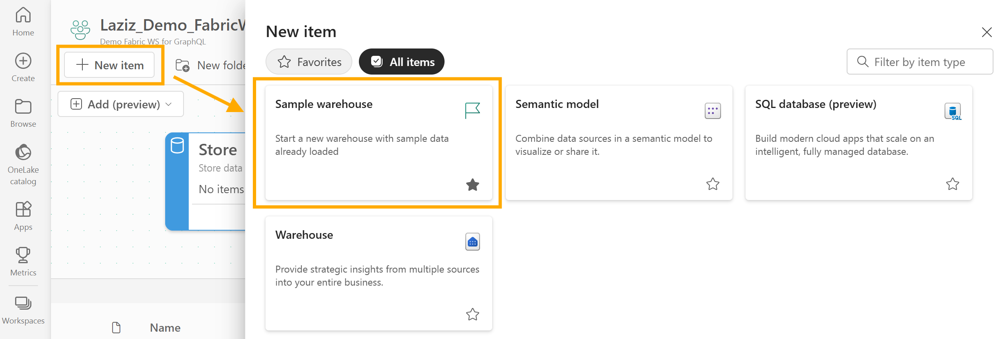
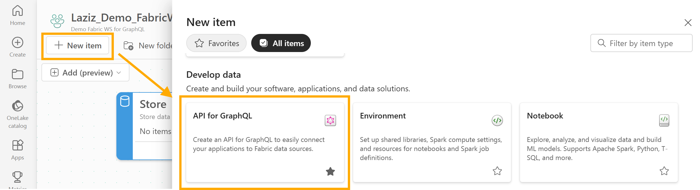
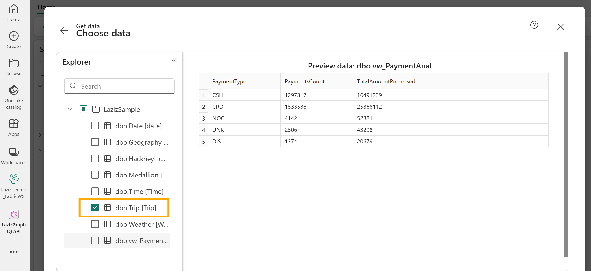
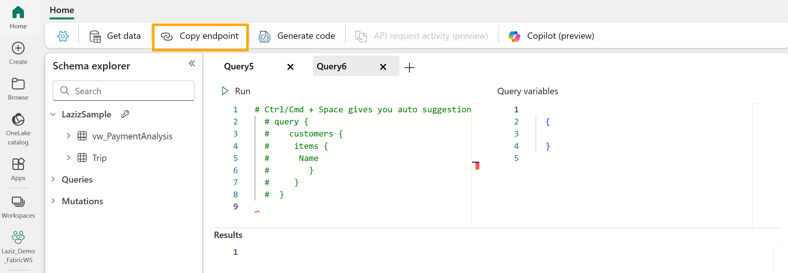
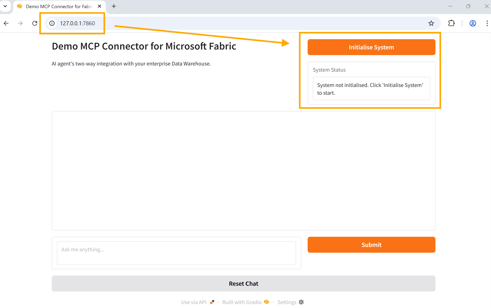
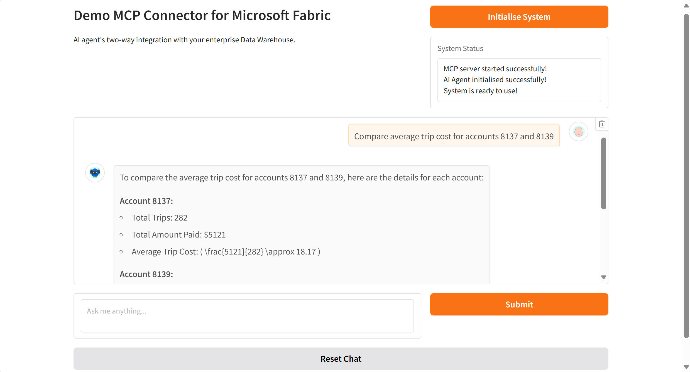

[](https://mseep.ai/app/lazauk-aifoundry-mcpconnector-fabricgraphql)

# MCP Connector: Integrating AI agent with Data Warehouse in Microsoft Fabric

This repo demonstrates the integration of an Azure OpenAI-powered AI agent with a Microsoft Fabric data warehouse using the Model Context Protocol (MCP), [open integration standard for AI agents by Anthropic](https://www.anthropic.com/news/model-context-protocol).

MCP enables dynamic discovery of tools, data resources and prompt templates (with more coming soon), unifying their integration with AI agents. GraphQL provides an abstraction layer for universal data connection. Below, you will find detailed steps on how to combine MCP and GraphQL to enable bidirectional access to enterprise data for your AI agent.

> [!NOTE]
> In the MCP server's script, some query parameter values are hard-coded for the sake of this example. In a real-world scenario, these values would be dynamically generated or retrieved.

## Table of contents:
- [Part 1: Configuring Microsoft Fabric Backend](#part-1-configuring-microsoft-fabric-backend)
- [Part 2: Configuring Local Client Environment](#part-2-configuring-local-client-environment)
- [Part 3: User Experience - Gradio UI](#part-3-user-experience---gradio-ui)
- [Part 4: Demo video on YouTube](#part-4-demo-video-on-youtube)

## Part 1: Configuring Microsoft Fabric Backend
1. In Microsoft Fabric, create a new data warehouse pre-populated by sample data by clicking *New item -> Sample warehouse*:

2. Next, create a GraphQL API endpoint by clicking *New item -> API for GraphQL*:

3. In the data configuration of GraphQL API, choose the *Trip (dbo.Trip)* table:

4. Copy the endpoint URL of your GraphQL API:


## Part 2: Configuring Local Client Environment
1. Install the required Python packages, listed in the provided *requirements.txt*:
```PowerShell
pip install -r requirements.txt
```
2. Configure environmnet variables for the MCP client:

| Variable                | Description                                      |
| ----------------------- | ------------------------------------------------ |
| `AOAI_API_BASE`         | Base URL of the Azure OpenAI endpoint            |
| `AOAI_API_VERSION`      | API version of the Azure OpenAI endpoint         |
| `AOAI_DEPLOYMENT`       | Deployment name of the Azure OpenAI model        |

3. Set the value of the `AZURE_FABRIC_GRAPHQL_ENDPOINT` variable with the GraphQL endpoint URL from Step 1.4 above. It will be utilised by the MCP Server script to establish connectivity with Microsoft Fabric:

| Variable                           | Description                                |
| -----------------------------------| ------------------------------------------ |
| `AZURE_FABRIC_GRAPHQL_ENDPOINT`    | Microsoft Fabric's GraphQL API endpoint    |

## Part 3: User Experience - Gradio UI
1. Launch the MCP client in your command prompt:
``` PowerShell
python MCP_Client_Gradio.py
```
2. Click the *Initialise System* button to start the MCP server and connect your AI agent to the Microsoft Fabric's GraphQL API endpoint:

3. You can now pull and push data to your data warehouse using GraphQL's **queries** and **mutations** enabled by this MCP connector:


## Part 4: Demo video on YouTube
A practical demo of the provided MCP connector can be found on this [YouTube video](https://youtu.be/R_tPzgEEHMw).
